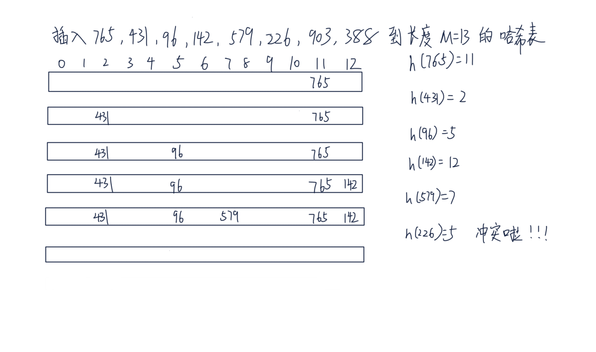

# 哈希表
不知道你有没有好奇过为什么 Python 里的 dict 和 set 查找速度这么快呢，用了什么黑魔法吗？
经常听别人说哈希表(也叫做散列表)，究竟什么是哈希表呢？这一章我们来介绍哈希表，后续章节我们会看到 Python 中的字典和集合是如何实现的。

# 哈希表的工作过程
前面我们已经讲到了数组和链表，数组能通过下标 O(1) 访问，但是删除一个中间元素却要移动其他元素，时间 O(n)。
循环双端链表倒是可以在知道一个节点的情况下迅速删除它，但是吧查找又成了 O(n)。

难道就没有一种方法可以快速定位和删除元素吗？似乎想要快速找到一个元素除了知道下标之外别无他法，于是乎聪明的计算机科学家又想到了一种方法。
能不能给每个元素一种『逻辑下标』，然后直接找到它呢，哈希表就是这种实现。它通过一个哈希函数来计算一个元素应该放在数组哪个位置，当然对于一个
特定的元素，哈希函数每次计算的下标必须要一样才可以，而且范围不能超过给定的数组长度。

我们还是以书中的例子说明，假如我们有一个数组 T，包含 M=13 个元素，我们可以定义一个简单的哈希函数 h

```
h(key) = key % M
```

这里取模运算使得 h(key) 的结果不会超过数组的长度下标。我们来分别插入以下元素：

765, 431, 96, 142, 579, 226, 903, 388

先来计算下它们应用哈希函数后的结果:

```
M = 13
h(765) = 765 % M = 11
h(431) = 431 % M = 2
h(96) = 96 % M = 5
h(142) = 142 % M = 12
h(579) = 579 % M = 7
h(226) = 226 % M = 5
h(903) = 903 % M = 6
h(388) = 388 % M = 11
```
下边我画个图演示整个插入过程(纯手工绘制，原谅我字写得不太优雅):




# 哈希冲突 (collision)
这里到插入 226 这个元素的时候，不幸地发现 h(226) = h(96) = 5，不同的 key 通过我们的哈希函数计算后得到的下标一样，
这种情况成为哈希冲突。怎么办呢？聪明的计算机科学家又想到了办法，其实一种直观的想法是如果冲突了我能不能让数组中
对应的槽变成一个链式结构呢？这就是其中一种解决方法，叫做 **链接法(chaining)**。如果我们用链接法来处理冲突，后边的插入是这样的：


这样就用链表解决了冲突问题，但是如果哈希函数选不好的话，可能就导致冲突太多一个链变得太长，这样查找就不再是 O(1) 的了。
还有一种叫做开放寻址法(open  addressing)，它的基本思想是当一个槽被占用的时候，采用一种方式来寻找下一个可用的槽。
（这里槽指的是数组中的一个位置），根据找下一个槽的方式不同，分为：

- 线性探查(linear probing): 当一个槽被占用，找下一个可用的槽。  $ h(k, i) = (h^\prime(k) + i)  \% m, i = 0,1,...,m-1 $
- 二次探查(quadratic probing): 当一个槽被占用，以二次方作为偏移量。 $ h(k, i) = (h^\prime(k) + c_1 + c_2i^2) \% m , i=0,1,...,m-1 $
- 双重散列(double hashing): 重新计算 hash 结果。 $ h(k,i) = (h_1(k) + ih_2(k)) \% m $

我们选一个简单的二次探查函数 $ h(k, i) = (home + i^2) \% m $，它的意思是如果
遇到了冲突，我们就在原始计算的位置不断加上 i 的平方。我写了段代码来模拟整个计算下标的过程：

```py
inserted_index_set = set()
M = 13

def h(key, M=13):
    return key % M

to_insert = [765, 431, 96, 142, 579, 226, 903, 388]
for number in to_insert:
    index = h(number)
    first_index = index
    i = 1
    while index in inserted_index_set:   # 如果计算发现已经占用，继续计算得到下一个可用槽的位置
        print('\th({number}) = {number} % M = {index} collision'.format(number=number, index=index))
        index = (first_index +  i*i) % M   # 根据二次方探查的公式重新计算下一个需要插入的位置
        i += 1
    else:
        print('h({number}) = {number} % M = {index}'.format(number=number, index=index))
        inserted_index_set.add(index)
```
这段代码输出的结果如下：

```
h(765) = 765 % M = 11
h(431) = 431 % M = 2
h(96) = 96 % M = 5
h(142) = 142 % M = 12
h(579) = 579 % M = 7
	h(226) = 226 % M = 5 collision
h(226) = 226 % M = 6
	h(903) = 903 % M = 6 collision
	h(903) = 903 % M = 7 collision
h(903) = 903 % M = 10
	h(388) = 388 % M = 11 collision
	h(388) = 388 % M = 12 collision
	h(388) = 388 % M = 2 collision
	h(388) = 388 % M = 7 collision
h(388) = 388 % M = 1
```

遇到冲突之后会重新计算，每个待插入元素最终的下标就是：


# Cpython 如何解决哈希冲突
如果你对 cpython 解释器的实现感兴趣，可以参考下这个文件 [dictobject.c](https://github.com/python/cpython/blob/master/Objects/dictobject.c#L165)。
不同 cpython 版本实现的探查方式是不同的，后边我们自己实现 HashTable ADT 的时候会模仿这个探查方式来解决冲突。


```
The first half of collision resolution is to visit table indices via this
recurrence:

    j = ((5*j) + 1) mod 2**i

For any initial j in range(2**i), repeating that 2**i times generates each
int in range(2**i) exactly once (see any text on random-number generation for
proof).  By itself, this doesn't help much:  like linear probing (setting
j += 1, or j -= 1, on each loop trip), it scans the table entries in a fixed
order.  This would be bad, except that's not the only thing we do, and it's
actually *good* in the common cases where hash keys are consecutive.  In an
example that's really too small to make this entirely clear, for a table of
size 2**3 the order of indices is:

    0 -> 1 -> 6 -> 7 -> 4 -> 5 -> 2 -> 3 -> 0 [and here it's repeating]
```

# 哈希函数
到这里你应该明白哈希表插入的工作原理了，不过有个重要的问题之前没提到，就是 hash 函数怎么选？
当然是散列得到的冲突越来越小就好啦，也就是说每个 key 都能尽量被等可能地散列到 m 个槽中的任何一个，并且与其他 key 被散列到哪个槽位无关。
如果你感兴趣，可以阅读后边提到的一些参考资料。视频里我们使用二次探查函数，它相比线性探查得到的结果冲突会更少。


# 装载因子(load factor)
如果继续往我们的哈希表里塞东西会发生什么？空间不够用。这里我们定义一个负载因子的概念(load factor)，其实很简单，就是已经使用的槽数比哈希表大小。
比如我们上边的例子插入了 8 个元素，哈希表总大小是 13， 它的 load factor 就是 $ 8/13 \approx 0.62 $。当我们继续往哈希表插入数据的时候，很快就不够用了。
通常当负载因子开始超过 0.8 的时候，就要新开辟空间并且重新进行散列了。


# 重哈希(Rehashing)
当负载因子超过 0.8 的时候，需要进行 rehashing 操作了。步骤就是重新开辟一块新的空间，开多大呢？感兴趣的话可以看下 cpython 的 dictobject.c 文件然后搜索
GROWTH_RATE 这个关键字，你会发现不同版本的 cpython 使用了不同的策略。python3.3 的策略是扩大为已经使用的槽数目的两倍。开辟了新空间以后，会把原来哈希表里
不为空槽的数据重新插入到新的哈希表里，插入方式和之前一样。这就是 rehashing 操作。

# HashTable ADT
实践是检验真理的唯一标准，这里我们来实现一个简化版的哈希表 ADT，主要是为了让你更好地了解它的工作原理，有了它，后边实现起 dict 和 set 来就小菜一碟了。
这里我们使用到了定长数组，还记得我们在数组和列表章节里实现的 Array 吧，这里要用上了。

解决冲突我们使用二次探查法，模拟 cpython 二次探查函数的实现。我们来实现三个哈希表最常用的基本操作，这实际上也是使用字典的时候最常用的操作。

- add(key, value)
- get(key, default)
- remove(key)

```py
class Slot(object):
    """定义一个 hash 表 数组的槽
    注意，一个槽有三种状态，看你能否想明白
    1.从未使用 HashMap.UNUSED。此槽没有被使用和冲突过，查找时只要找到 UNUSED 就不用再继续探查了
    2.使用过但是 remove 了，此时是 HashMap.EMPTY，该探查点后边的元素扔可能是有key
    3.槽正在使用 Slot 节点
    """
    def __init__(self, key, value):
        self.key, self.value = key, value

class HashTable(object):
    pass
```

具体的实现和代码编写在视频里讲解。这个代码可不太好实现，稍不留神就会有错，我们还是通过编写单元测试验证代码的正确性。

# 思考题
- 请你分析下哈希表插入和删除元素的平均时间复杂度是多少？我们都实现代码了，相信这个问题你可以回答上来
- Slot 在二次探查法里为什么不能直接删除？为什么我们要给它定义几个状态？

# 延伸阅读
- 《Data Structures and Algorithms in Python》11 章 Hash Tables
- 《算法导论》第三版 11 章散列表，了解几种哈希冲突的解决方式，以及为什么我们选择二次探查而不是线性探查法？
- 介绍 c 解释器如何实现的 python dict对象：[Python dictionary implementation](http://www.laurentluce.com/posts/python-dictionary-implementation/)
- [Python hash function implement](https://stackoverflow.com/questions/2070276/where-can-i-find-source-or-algorithm-of-pythons-hash-function)
