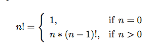
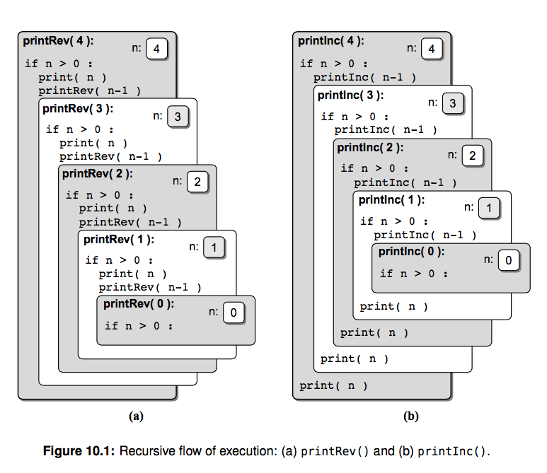
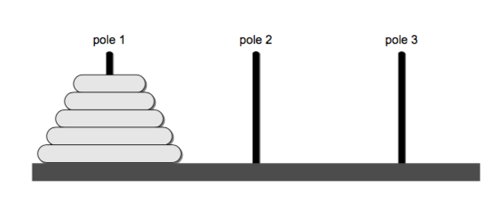
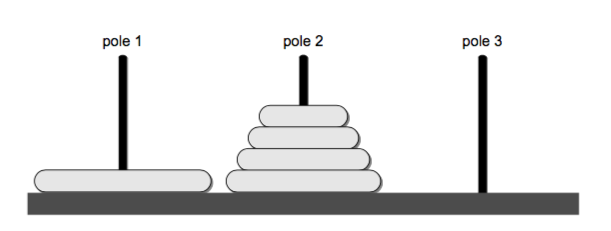

# 递归

>    Recursion is a process for solving problems by subdividing a larger
>    problem into smaller cases of the problem itself and then solving
>    the smaller, more trivial parts.

递归是计算机科学里出现非常多的一个概念，有时候用递归解决问题看起来非常简单优雅。
之前讲过的数据结构中我们并没有使用递归，因为递归涉及到调用栈，可能会让初学者搞晕。这一章我们开始介绍递归，
后边讲到树和一些排序算法的时候我们还会碰到它。我非常推荐你先看看《算法图解》第三章 递归，
举的例子比较浅显易懂。


# 什么是递归？
递归用一种通俗的话来说就是自己调用自己，但是需要分解它的参数，让它解决一个更小一点的问题，当问题小到一定规模的时候，需要一个递归出口返回。
这里举一个和其他很多老套的教科书一样喜欢举的例子，阶乘函数，我觉得用来它演示再直观不过。它的定义是这样的：



我们很容易根据它的定义写出这样一个递归函数，因为它本身就是递归定义的。

```py
def fact(n):
    if n == 0:
        return 1
    else:
        return n * fact(n-1)
```
看吧，几乎完全是按照定义来写的。我们来看下递归函数的几个特点:

- 递归必须包含一个基本的出口(base case)，否则就会无限递归，最终导致栈溢出。比如这里就是 n == 0 返回 1
- 递归必须包含一个可以分解的问题(recursive case)。 要想求得 fact(n)，就需要用 n * fact(n-1)
- 递归必须必须要向着递归出口靠近(toward the base case)。 这里每次递归调用都会 n-1，向着递归出口 n == 0 靠近


# 调用栈
看了上一个例子你可能觉得递归好简单，先别着急，我们再举个简单的例子，上边我们并没有讲递归如何工作的。
假如让你输出从 1 到 10 这十个数字，如果你是个正常人的话，我想你的第一反应都是这么写：

```py
def print_num(n):
    for i in range(1, n + 1):    # 注意很多编程语言使用的都是 从 0 开始的左闭右开区间, python 也不例外
        print(i)


if __name__ == '__main__':
    print_num(10)
```

我们尝试写一个递归版本，不就是自己调用自己嘛：

```py
def print_num_recursive(n):
    if n > 0:
        print_num_recursive(n-1)
        print(n)
```

你猜下它的输出？然后我们调换下 print 顺序，你再猜下它的输出

```py
def print_num_recursive_revserve(n):
    if n > 0:
        print(n)
        print_num_recursive_revserve(n-1)
```
你能明白是为什么吗？我建议你运行下这几个小例子，它们很简单但是却能说明问题。
计算机内部使用调用栈来实现递归，这里的栈一方面指的是内存中的栈区，一方面栈又是之前讲到的后进先出这种数据结构。
每当进入递归函数的时候，系统都会为当前函数开辟内存保存当前变量值等信息，每个调用栈之间的数据互不影响，新调用的函数
入栈的时候会放在栈顶。视频里我们会画图来演示这个过程。

递归只用大脑不用纸笔模拟的话很容易晕，因为明明是同一个变量名字，但是在不同的调用栈里它是不同的值，所以我建议
你最好手动画画这个过程。



# 用栈模拟递归
刚才说到了调用栈，我们就用栈来模拟一把。之前栈这一章我们讲了如何自己实现栈，不过这里为了不拷贝太多代码，我们直接用 collections.deque 就可以
快速实现一个简单的栈。

```py
from collections import deque


class Stack(object):
    def __init__(self):
        self._deque = deque()

    def push(self, value):
        return self._deque.append(value)

    def pop(self):
        return self._deque.pop()

    def is_empty(self):
        return len(self._deque) == 0


def print_num_use_stack(n):
    s = Stack()
    while n > 0:    # 不断将参数入栈
        s.push(n)
        n -= 1

    while not s.is_empty():    # 参数弹出
        print(s.pop())
```
这里结果也是输出 1 到 10，只不过我们是手动模拟了入栈和出栈的过程，帮助你理解计算机是如何实现递归的，是不是挺简单！现在你能明白为什么上边 print_num_recursive print_num_recursive_revserve 两个函数输出的区别了吗？


# 尾递归
上边的代码示例(麻雀虽小五脏俱全)中实际上包含了两种形式的递归，一种是普通的递归，还有一种叫做尾递归：

```py
def print_num_recursive(n):
    if n > 0:
        print_num_recursive(n-1)
        print(n)


def print_num_recursive_revserve(n):
    if n > 0:
        print(n)
        print_num_recursive_revserve(n-1)    # 尾递归
```

概念上它很简单，就是递归调用放在了函数的最后。有什么用呢？
普通的递归, 每一级递归都产生了新的局部变量, 必须创建新的调用栈, 随着递归深度的增加, 创建的栈越来越多, 造成爆栈。虽然尾递归调用也会创建新的栈,
但是我们可以优化使得尾递归的每一级调用共用一个栈!, 如此便可解决爆栈和递归深度限制的问题!
不幸的是 python 默认不支持尾递归优化（见延伸阅读），不过一般尾递归我们可以用一个迭代来优化它。


# 汉诺塔问题

有三根杆子A，B，C。A杆上有N个(N>1)穿孔圆盘，盘的尺寸由下到上依次变小。要求按下列规则将所有圆盘移至C杆：
但是有两个条件：

- 每次只能移动一个圆盘；
- 大盘不能叠在小盘上面。

> 最早发明这个问题的人是法国数学家爱德华·卢卡斯。
> 传说越南河内某间寺院有三根银棒，上串64个金盘。寺院里的僧侣依照一个古老的预言，以上述规则移动这些盘子；预言说当这些盘子移动完毕，世界就会灭亡。
> 这个传说叫做梵天寺之塔问题（Tower of Brahma puzzle）。但不知道是卢卡斯自创的这个传说，还是他受他人启发。




理解这个问题需要我们一些思维上的转换，因为我们正常的思维可能都是从上边最小的盘子开始移动，但是这里我们从移动最底下的盘子开始思考。
假设我们已经知道了如何移动上边的四个盘子到 B(pole2)，现在把最大的盘子从 A -> C 就很简单了。当把最大的盘子移动到
C 之后，只需要把 B 上的 4 个盘子从 B -> C 就行。（这里的 pole1, 2, 3 分别就是 A, B, C 杆）



问题是仍要想办法如何移动上边的 4 个盘子，我们可以同样的方式来移动上边的 4 个盘子，这就是一种递归的解法。
给定 n 个盘子和三个杆分别是 源杆(Source), 目标杆(Destination)，和中介杆(Intermediate)，我们可以定义如下递归操作：

- 把上边的 n-1 个盘子从 S 移动到 I，借助 D 杆
- 把最底下的盘子从 S 移动到 D
- 把 n-1 个盘子从 I 移动到 D，借助 S

我们把它转换成代码：

```py
def hanoi_move(n, source, dest, intermediate):
    if n >= 1:  # 递归出口，只剩一个盘子
        hanoi_move(n-1, source, intermediate, dest)
        print("Move %s -> %s" % (source, dest))
        hanoi_move(n-1, intermediate, dest, source)
hanoi_move(3, 'A', 'C', 'B')

# 输出，建议你手动模拟下。三个盘子 A(Source), B(intermediate), C(Destination)
"""
Move A -> C
Move A -> B
Move C -> B
Move A -> C
Move B -> A
Move B -> C
Move A -> C
"""
```

<center>

</center>

是不是很神奇，但是老实说这个过程仅凭大脑空想是比较难以想象出来的。人的大脑『栈』深度很有限，因为你甚至都没法同时记住超过 8 个以上的
无意义数字，所以用大脑模拟不如用纸笔来模拟下。（不排除有些聪明的同学能迅速在脑瓜里完成这个过程）

# 延伸阅读
递归是个非常重要的概念，我们后边的数据结构和算法中还会多次碰到它，我建议你多阅读一些资料加深理解：

- 《算法图解》第三章 递归
- 《Data Structures and Algorithms in Python》 第 10 章 Recursion
- [《Python开启尾递归优化!》](https://segmentfault.com/a/1190000007641519)
- [尾调用优化](http://www.ruanyifeng.com/blog/2015/04/tail-call.html)
- [汉诺塔](https://zh.wikipedia.org/wiki/%E6%B1%89%E8%AF%BA%E5%A1%94)

# 思考题
- 你能举出其他一些使用到递归的例子吗？
- 实现一个 flatten 函数，把嵌套的列表扁平化，你需要用递归函数来实现。比如 [[1,2], [1,2,3] -> [1,2,1,2,3]
- 使用递归和循环各有什么优缺点，你能想到吗？怎么把一个尾递归用迭代替换？
- 递归有时候虽然很优雅直观，但是时间复杂度却不理想，比如斐波那契数列，它的表达式是 F(n) = F(n-1) + F(n-2)，你能计算它的时间复杂度吗？请你画个树来表示它的计算过程，为什么这个时间复杂度很不理想？我们怎样去优化它。
- python 内置的 dict 只能用 dict['key'] 的形式访问比较麻烦，我们想用 dict.key 的形式访问。tornado web 框架中提供了一个 ObjectDict，请你实现一个递归函数接收一个字典，并返回一个可以嵌套访问的 ObjectDict
