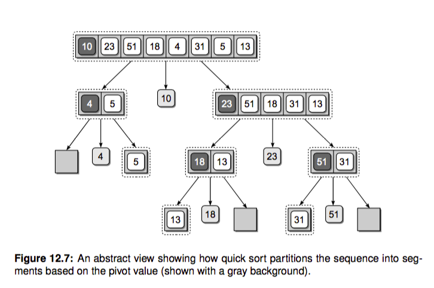

# 快速排序

快速排序名字可不是盖的，很多程序语言标准库实现的内置排序都有它的身影，我们就直奔主题吧。
和归并排序一样，快排也是一种分而治之(divide and conquer)的策略。归并排序把数组递归成只有单个元素的数组，之后再不断两两
合并，最后得到一个有序数组。这里的递归基本条件就是只包含一个元素的数组，当数组只包含一个元素的时候，我们可以认为它本来就是有序的（当然空数组也不用排序）。

快排的工作过程其实比较简单，三步走：

- 选择基准值 pivot 将数组分成两个子数组：小于基准值的元素和大于基准值的元素。这个过程称之为 partition

- 对这两个子数组进行快速排序。

- 合并结果



根据这个想法我们可以快速写出快排的代码，简直就是在翻译上边的描述：

```py
def quicksort(array):
    size = len(array)
    if not array or size < 2:  # NOTE: 递归出口，空数组或者只有一个元素的数组都是有序的
        return array
    pivot_idx = 0
    pivot = array[pivot_idx]
    less_part = [array[i] for i in range(size) if array[i] <= pivot and pivot_idx != i]
    great_part = [array[i] for i in range(size) if array[i] > pivot and pivot_idx != i]
    return quicksort(less_part) + [pivot] + quicksort(great_part)

def test_quicksort():
    import random
    seq = list(range(10))
    random.shuffle(seq)
    assert quicksort(seq) == sorted(seq)
```
是不是很简单，下次面试官让你手写快排你再写不出来就有点不太合适啦。 当然这个实现有两个不好的地方:

- 第一是它需要额外的存储空间，我们想实现 inplace 原地排序。
- 第二是它的 partition 操作每次都要两次遍历整个数组，我们想改善一下。

这里我们就来优化一下它，实现 inplace 排序并且改善下 partition 操作。新的代码大概如下：

```py
def quicksort_inplace(array, beg, end):    # 注意这里我们都用左闭右开区间，end 传入 len(array)
    if beg < end:    # beg == end 的时候递归出口
        pivot = partition(array, beg, end)
        quicksort_inplace(array, beg, pivot)
        quicksort_inplace(array, pivot+1, end)
```

能否实现只遍历一次数组就可以完成 partition 操作呢？实际上是可以的。我们设置首位俩个指针 left, right，两个指针不断向中间收拢。如果遇到 left 位置的元素大于 pivot 并且 right 指向的元素小于 pivot，我们就交换这俩元素，当 left > right 的时候退出就行了，这样实现了一次遍历就完成了 partition。如果你感觉懵逼，纸上画画就立马明白了。我们来撸代码实现：


```py
def partition(array, beg, end):
    pivot_index = beg
    pivot = array[pivot_index]
    left = pivot_index + 1
    right = end - 1    # 开区间，最后一个元素位置是 end-1     [0, end-1] or [0: end)，括号表示开区间

    while True:
        # 从左边找到比 pivot 大的
        while left <= right and array[left] < pivot:
            left += 1

        while right >= left and array[right] >= pivot:
            right -= 1

        if left > right:
            break
        else:
            array[left], array[right] = array[right], array[left]

    array[pivot_index], array[right] = array[right], array[pivot_index]
    return right   # 新的 pivot 位置


def test_partition():
    l = [4, 1, 2, 8]
    assert partition(l, 0, len(l)) == 2
    l = [1, 2, 3, 4]
    assert partition(l, 0, len(l)) == 0
    l = [4, 3, 2, 1]
    assert partition(l, 0, len(l))
```

大功告成，新的快排就实现好了。

# 时间复杂度
在比较理想的情况下，比如数组每次都被 pivot 均分，我们可以得到递归式：

T(n) = 2T(n/2) + n

上一节我们讲过通过递归树得到它的时间复杂度是 O(nlog(n))。即便是很坏的情况，比如 pivot 每次都把数组按照 1:9 划分，依然是 O(nlog(n))，感兴趣请阅读算法导论相关章节。


# 思考题
- 请你补充 quicksort_inplace 的单元测试
- 最坏的情况下快排的时间复杂度是多少？什么时候会发生这种情况？
- 我们实现的快排是稳定的啵？
- 选择基准值如果选不好就可能导致复杂度升高，算导中提到了一种『median of 3』策略，就是说选择 pivot 的时候 从子数组中随机选三个元素，再取它的中位数，你能实现这个想法吗？这里我们的代码很简单地取了第一个元素作为 pivot
- 利用快排中的 partition 操作，我们还能实现另一个算法，nth_element，快速查找一个无序数组中的第 n 大元素，请你尝试实现它并编写单测。其实这个函数是 C++ STL 中的一个函数。
- 你知道 Python 内置的 sorted 如何实现的吗？请你 Google 相关资料了解下。很多内置的排序都使用了快排的改良版。


# 延伸阅读
- 《算法导论》第 7 章
- [《面试必备 | 排序算法的Python实现》](https://zhuanlan.zhihu.com/p/36419582)

# 总结

面试经常问的就是常用排序算法的时间空间复杂，这里列一个表格方便记忆：

| 排序算法   | 最差时间分析 | 平均时间复杂度 | 稳定度 | 空间复杂度     |
|------------|--------------|----------------|--------|----------------|
| 冒泡排序   | O(n^2)       | O(n^2)         | 稳定   | O(1)           |
| 选择排序   | O(n^2)       | O(n^2)         | 不稳定 | O(1)           |
| 插入排序   | O(n^2)       | O(n^2)         | 稳定   | O(1)           |
| 二叉树排序 | O(n^2)       | O(n\*log2n)    | 不一顶 | O(n)           |
| 快速排序   | O(n^2)       | O(n\*log2n)    | 不稳定 | O(log2n)\~O(n) |
| 堆排序     | O(n\*log2n)  | O(n\*log2n)    | 不稳定 | O(1)           |

[数据结构与算法-排序篇-Python描述](https://blog.csdn.net/mrlevo520/article/details/77829204<Paste>)

# Leetcode

无序数组寻找第 k 大的数字，不止一种方法。
https://leetcode.com/problems/kth-largest-element-in-an-array/description/
