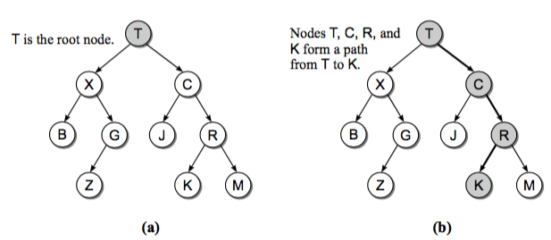

# 树和二叉树
前面我们讲了两种使用分治和递归解决排序问题的归并排序和快速排序，堆排序先就此打住，因为涉及到树的概念，所以我们先来讲讲树。
讲完了树之后后面我们开始介绍一种有用的数据结构堆(heap)， 以及借助堆来实现的堆排序，相比前两种排序算法要稍难理解和实现一些。

# 树
这里先简单讲讲树的概念。树结构是一种包括节点(nodes)和边(edges)的拥有层级关系的一种结构， 它的形式和家谱树非常类似:

如果你了解 linux 文件结构（tree 命令），它的结构也是一棵树。我们快速看下树涉及到的一些概念：

- 根节点(root): 树的最上层的节点，任何非空的树都有一个节点
- 路径(path): 从起始节点到终止节点经历过的边
- 父亲(parent)：除了根节点，每个节点的上一层又边连接的节点就是它的父亲(节点)
- 孩子(children): 每个节点由边指向的下一层节点
- 兄弟(siblings): 同一个父亲并且处在同一层的节点
- 子树(subtree): 每个节点包含它所有的后代组成的子树

# 二叉树

了解完树的结构以后，我们来看树结构里一种简单但是却比较常用的树-二叉树。
二叉树是一种简单的树，它的每个节点最多只能包含两个孩子，以下都是一些合法的二叉树:

# 树的表示

# 思考题

# 延伸阅读
- 《算法导论》第 6 章 Heapsort
- 《Data Structures and Algorithms in Python》 13 章
