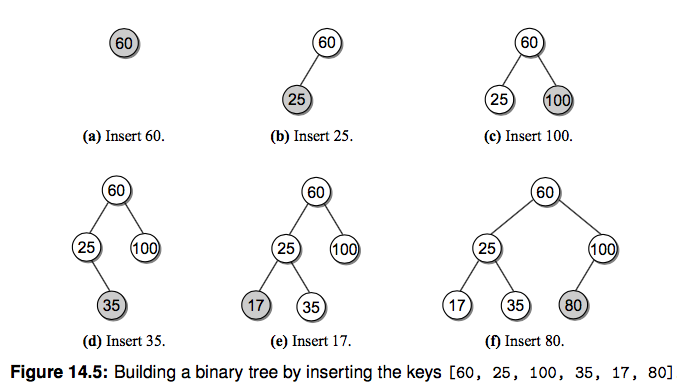
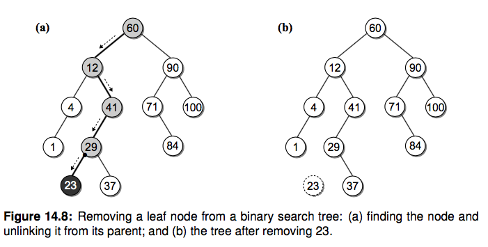
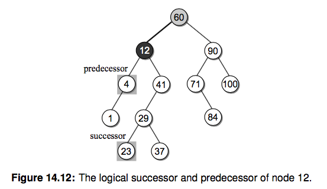
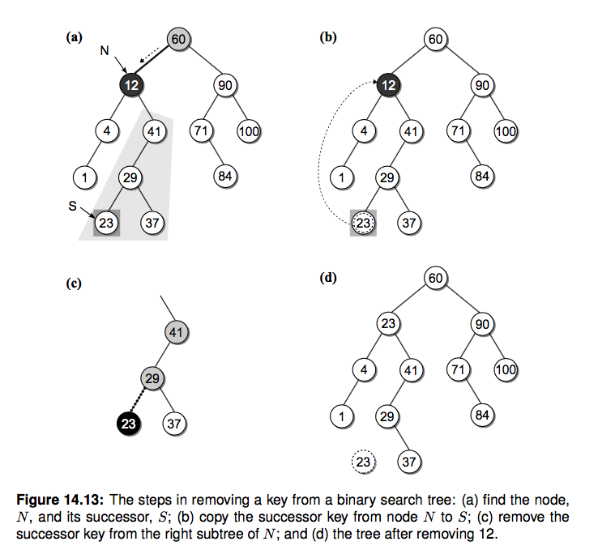

# 二叉查找树(BST)

二叉树的一种应用就是来实现堆，今天我们再看看用二叉查找树(Binary Search Tree, BST)。
前面有章节说到了查找操作，包括线性查找、二分查找、哈希查找等，线性查找效率比较低，二分又要求必须是有序的序列，
为了维持有序插入的代价比较高、哈希查找效率很高但是浪费空间。能不能有一种插入和查找都比较快的数据结构呢？二叉查找树就是这样一种结构，可以高效地插入和查询节点。

# BST 定义

二叉查找树是这样一种二叉树结构，它的每个节点包含一个 key 和它附带的数据，对于每个内部节点 V：

- 所有 key 小于 V 的都被存储在 V 的左子树
- 所有 key 大于 V 的都存储在 V 的右子树


注意这个限制条件，可别和堆搞混了。说白了就是对于每个内部节点，左子树的 key 都比它小，右子树都比它大。
如果中序遍历(二叉树遍历讲过了)这颗二叉树，你会发现输出的顺序正好是有序的。
我们先来定义一下 BST 的节点结构：

```py
class BSTNode(object):
    def __init__(self, key, value, left=None, right=None):
        self.key, self.value, self.left, self.right = key, value, left, right
```

# 构造一个 BST
我们还像之前构造二叉树一样，按照上图构造一个 BST 用来演示：

```py
class BST(object):
    def __init__(self, root=None):
        self.root = root

    @classmethod
    def build_from(cls, node_list):
        cls.size = 0
        key_to_node_dict = {}
        for node_dict in node_list:
            key = node_dict['key']
            key_to_node_dict[key] = BSTNode(key, value=key)   # 这里值暂时用 和 key一样的

        for node_dict in node_list:
            key = node_dict['key']
            node = key_to_node_dict[key]
            if node_dict['is_root']:
                root = node
            node.left = key_to_node_dict.get(node_dict['left'])
            node.right = key_to_node_dict.get(node_dict['right'])
            cls.size += 1
        return cls(root)


NODE_LIST = [
    {'key': 60, 'left': 12, 'right': 90, 'is_root': True},
    {'key': 12, 'left': 4, 'right': 41, 'is_root': False},
    {'key': 4, 'left': 1, 'right': None, 'is_root': False},
    {'key': 1, 'left': None, 'right': None, 'is_root': False},
    {'key': 41, 'left': 29, 'right': None, 'is_root': False},
    {'key': 29, 'left': 23, 'right': 37, 'is_root': False},
    {'key': 23, 'left': None, 'right': None, 'is_root': False},
    {'key': 37, 'left': None, 'right': None, 'is_root': False},
    {'key': 90, 'left': 71, 'right': 100, 'is_root': False},
    {'key': 71, 'left': None, 'right': 84, 'is_root': False},
    {'key': 100, 'left': None, 'right': None, 'is_root': False},
    {'key': 84, 'left': None, 'right': None, 'is_root': False},
]
bst = BST.build_from(NODE_LIST)
```


# BST 操作

## 查找
如何查找一个指定的节点呢，根据定义我们知道每个内部节点左子树的 key 都比它小，右子树的 key 都比它大，所以
对于带查找的节点 search_key，从根节点开始，如果 search_key 大于当前 key，就去右子树查找，否则去左子树查找。 一直到当前节点是 None 了说明没找到对应 key。


好，撸代码：

```py
    def _bst_search(self, subtree, key):
        if subtree is None:   # 没找到
            return None
        elif key < subtree.key:
            return self._bst_search(subtree.left, key)
        elif key > subtree.key:
            return self._bst_search(subtree.right, key)
        else:
            return subtree

    def get(self, key, default=None):
        node = self._bst_search(self.root, key)
        if node is None:
            return default
        else:
            return node.value
```


## 获取最大和最小 key 的节点

其实还按照其定义，最小值就一直向着左子树找，最大值一直向右子树找，递归查找就行。

```py
    def _bst_min_node(self, subtree):
        if subtree is None:
            return None
        elif subtree.left is None:   # 找到左子树的头
            return subtree
        else:
            return self._bst_min_node(subtree.left)

    def bst_min(self):
        node = self._bst_min_node(self.root)
        return node.value if node else None
```

## 插入
插入节点的时候我们需要一直保持 BST 的性质，每次插入一个节点，我们都通过递归比较把它放到正确的位置。
你会发现新节点总是被作为叶子结点插入。（请你思考这是为什么）



```py
    def _bst_insert(self, subtree, key, value):
        """ 插入并且返回根节点

        :param subtree:
        :param key:
        :param value:
        """
        if subtree is None:   # 插入的节点一定是根节点，包括 root 为空的情况
            subtree = BSTNode(key, value)
        elif key < subtree.key:
            subtree.left = self._bst_insert(subtree.left, key, value)
        elif key > subtree.key:
            subtree.right = self._bst_insert(subtree.right, key, value)
        return subtree

    def add(self, key, value):
        node = self._bst_search(self.root, key)
        if node is not None:   # 更新已经存在的 key
            node.value = value
            return False
        else:
            self.root = self._bst_insert(self.root, key, value)
            self.size += 1
            return True
```

## 删除节点
删除操作相比上边的操作要麻烦很多，首先需要定位一个节点，删除节点后，我们需要始终保持 BST 的性质。
删除一个节点涉及到三种情况：

- 节点是叶节点
- 节点有一个孩子
- 节点有两个孩子

我们分别来看看三种情况下如何删除一个节点：

#### 删除叶节点
这是最简单的一种情况，只需要把它的父亲指向它的指针设置为 None 就好。



#### 删除只有一个孩子的节点
删除有一个孩子的节点时，我们拿掉需要删除的节点，之后把它的父亲指向它的孩子就行，因为根据 BST
左子树都小于节点，右子树都大于节点的特性，删除它之后这个条件依旧满足。


#### 删除有两个孩子的内部节点
假如我们想删除 12 这个节点改怎么做呢？你的第一反应可能是按照下图的方式：


但是这种方式可能会影响树的高度，降低查找的效率。这里我们用另一种非常巧妙的方式。
还记得上边提到的吗，如果你中序遍历 BST 并且输出每个节点的 key，你会发现就是一个有序的数组。
`[1 4 12 23 29 37 41 60 71 84 90 100]`。这里我们定义两个概念，逻辑前任(predecessor)和后继(successor)，请看下图:



12 在中序遍历中的逻辑前任和后继分别是 4 和 23 节点。于是我们还有一种方法来删除 12 这个节点：

- 找到待删除节点 N(12) 的后继节点 S(23)
- 复制节点 S 到节点 N
- 从 N 的右子树中删除节点 S，并更新其删除后继节点后的右子树

说白了就是找到后继并且替换，这里之所以能保证这种方法是正确的，你会发现替换后依旧是保持了 BST 的性质。
有个问题是如何找到后继节点呢？待删除节点的右子树的最小的节点不就是后继嘛，上边我们已经实现了找到最小 key 的方法了。




我们开始编写代码实现，和之前的操作类似，我们还是通过辅助函数的形式来实现，这个递归函数会比较复杂，请你仔细理解:

```py
    def _bst_remove(self, subtree, key):
        """删除节点并返回根节点"""
        if subtree is None:
            return None
        elif key < subtree.key:
            subtree.left = self._bst_remove(subtree.left, key)
            return subtree
        elif key > subtree.key:
            subtree.right = self._bst_remove(subtree.right, key)
            return subtree
        else:  # 找到了需要删除的节点
            if subtree.left is None and subtree.right is None:    # 叶节点，返回 None 把其父亲指向它的指针置为 None
                return None
            elif subtree.left is None or subtree.right is None:  # 只有一个孩子
                if subtree.left is not None:
                    return subtree.left   # 返回它的孩子并让它的父亲指过去
                else:
                    return subtree.right
            else:  # 俩孩子，寻找后继节点替换，并从待删节点的右子树中删除后继节点
                successor_node = self._bst_min_node(subtree.right)
                subtree.key, subtree.value = successor_node.key, successor_node.value
                subtree.right = self._bst_remove(subtree.right, successor_node.key)
                return subtree

    def remove(self, key):
        assert key in self
        self.size -= 1
        return self._bst_remove(self.root, key)
```

完整代码你可以在本章的 bst.py  找到。
另外推荐一个可以在线演示过程的网址大家可以手动执行下看看效果： https://www.cs.usfca.edu/~galles/visualization/BST.html

# 时间复杂度分析

上边介绍的操作时间复杂度和二叉树的形状有关。平均来说时间复杂度是和树的高度成正比的，树的高度 h 是 log(n)，
但是最坏情况下以上操作的时间复杂度都是 O(n)。为了改善 BST 有很多变种，感兴趣请参考延伸阅读中的内容。


# 练习题：
- 请你实现查找 BST 最大值的函数


# 延伸阅读
- 《Data Structures and Algorithms in Python》14 章，树的概念和算法还有很多，我们这里介绍最基本的帮你打个基础
- 了解红黑树。普通二叉查找树有个很大的问题就是难以保证树的平衡，极端情况下某些节点可能会非常深，导致查找复杂度大幅退化。而平衡二叉树就是为了解决这个问题。请搜索对应资料了解下。
- 了解 mysql 索引使用的 B-Tree 结构(多路平衡查找树)，这个是后端面试数据库的常考点。想想为什么？当元素非常多的时候，二叉树的深度会很深，导致多次磁盘查找。[从B树、B+树、B*树谈到R 树](https://blog.csdn.net/v_JULY_v/article/details/6530142)


# Leetcode

验证是否是合法二叉搜索树 [validate-binary-search-tree](https://leetcode.com/problems/validate-binary-search-tree/
