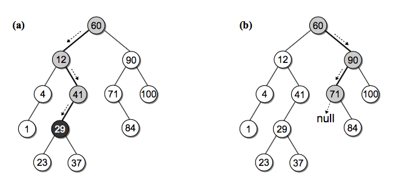

# 二叉查找树(BST)

二叉树的一种应用就是来实现堆，今天我们再看看用二叉查找树。
前面有章节说到了查找操作，包括线性查找和二分查找，线性查找效率比较低，二分又要求必须是有序的序列，
为了维持有序插入的代价比较高。能不能有一种插入和查找都比较快的数据结构呢？

# BST 定义

二叉查找树是这样一种二叉树结构，它的每个节点包含一个 key 和它附带的数据，对于每个内部节点 V：
- 所有 key 小于 V 的都被存储在 V 的左子树
- 所有 key 大于 V 的都存储在 V 的右子树


注意这个限制条件，可别和堆搞混了。说白了就是对于每个内部节点，左子树的 key 都比它小，右子树都比它大。
如果中序遍历(二叉树遍历讲过了)这颗二叉树，你会发现输出的顺序正好是有序的。
我们先来定义一下 BST 的节点结构：

```py
class BSTNode(object):
    def __init__(self, key, value, left=None, right=None):
        self.key, self.value, self.left, self.right = key, value, left, right
```

# 构造一个 BST
我们还像之前构造二叉树一样，按照上图构造一个 BST 用来演示：

```py
class BST(object):
    def __init__(self, root=None):
        self.root = root

    @classmethod
    def build_from(cls, node_list):
        cls.size = 0
        key_to_node_dict = {}
        for node_dict in node_list:
            key = node_dict['key']
            key_to_node_dict[key] = BSTNode(key, value=key)   # 这里值暂时用 和 key一样的

        for node_dict in node_list:
            key = node_dict['key']
            node = key_to_node_dict[key]
            if node_dict['is_root']:
                root = node
            node.left = key_to_node_dict.get(node_dict['left'])
            node.right = key_to_node_dict.get(node_dict['right'])
            cls.size += 1
        return cls(root)


NODE_LIST = [
    {'key': 60, 'left': 12, 'right': 90, 'is_root': True},
    {'key': 12, 'left': 4, 'right': 41, 'is_root': False},
    {'key': 4, 'left': 1, 'right': None, 'is_root': False},
    {'key': 1, 'left': None, 'right': None, 'is_root': False},
    {'key': 41, 'left': 29, 'right': None, 'is_root': False},
    {'key': 29, 'left': 23, 'right': 37, 'is_root': False},
    {'key': 23, 'left': None, 'right': None, 'is_root': False},
    {'key': 37, 'left': None, 'right': None, 'is_root': False},
    {'key': 90, 'left': 71, 'right': 100, 'is_root': False},
    {'key': 71, 'left': None, 'right': 84, 'is_root': False},
    {'key': 100, 'left': None, 'right': None, 'is_root': False},
    {'key': 84, 'left': None, 'right': None, 'is_root': False},
]
bst = BST.build_from(NODE_LIST)
```


# BST 操作

## 查找
如何查找一个指定的节点呢，根据定义我们知道每个内部节点左子树的 key 都比它小，右子树的 key 都比它大，所以
对于带查找的节点 search_key，从根节点开始，如果 search_key 大于当前 key，就去右子树查找，否则去左子树查找。 一直到当前节点是 None 了说明没找到对应 key。



好，撸代码：

```py
    def _bst_search(self, subtree, key):
        if subtree is None:   # 没找到
            return None
        elif key < subtree.key:
            return self._bst_search(subtree.left, key)
        elif key > subtree.key:
            return self._bst_search(subtree.right, key)
        else:
            return subtree

    def get(self, key, default=None):
        node = self._bst_search(self.root, key)
        if node is None:
            return default
        else:
            return node.value
```


## 获取最大和最小 key 的节点

其实还按照其定义，最小值就一直向着左子树找，最大值一直向右子树找，递归查找就行。

```py
    def _bst_min_node(self, subtree):
        if subtree is None:
            return None
        elif subtree.left is None:   # 找到左子树的头
            return subtree
        else:
            return self._bst_min_node(subtree.left)

    def bst_min(self):
        node = self._bst_min_node(self.root)
        return node.value if node else None
```

## 插入
插入节点的时候我们需要一直保持 BST 的性质，每次插入一个节点，我们都通过递归比较把它放到正确的位置。

```py
    def _bst_insert(self, subtree, key, value):
        if subtree is None:
            subtree = BSTNode(key, value)
        elif key < subtree.key:
            subtree.left = self._bst_insert(subtree.left, key, value)
        elif key > subtree.key:
            subtree.right = self._bst_insert(subtree.right, key, value)
        return subtree

    def add(self, key, value):
        node = self._bst_search(self.root, key)
        if node is not None:   # 更新已经存在的 key
            node.value = value
            return False
        else:
            self.root = self._bst_insert(self.root, key, value)
            self.size += 1
            return True
```

## 删除

# 练习题：
- 请你实现查找 BST 最大值的函数


# 延伸阅读
- 《Data Structures and Algorithms in Python》14 章
